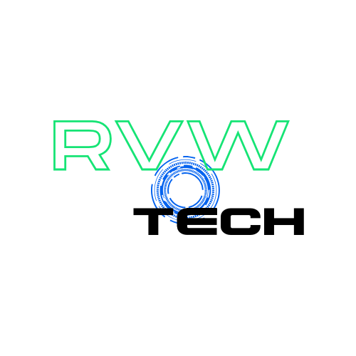

    preview do podcast

    <audio src="output/podcast_editado.m4a" controls title="Podcast editado"></audio>

# Projeto Podcast Gerado por I.A.s

 > ℹ️ **NOTE:** Este é o repositório desenvolvido durante uma live no Youtube em parceria com a [DIO](https://dio.me)

Projeto com o objetivo de gerar um podcast utilizando ferramentas de IA através de prompts mais trabalhado.

Utilizer uma esteira de prompts para gerar cada etapa do processo criativo.

## 💻 Tecnologias utilizadas no projeto

- [Copilot](https://copilot.microsoft.com/) 
- [Clipchamp](https://clipchamp.com/)

## ✨ Como foi feito ?

- Roteiro gerado via Copilot
- Usei meu logo em vez de uma imagem de capa
- Clipchamp para gerar e tratar o aúdio e adicionar sons de fundo

## 📚 Materiais

- [Link da live no Youtube](https://www.youtube.com)
- [Notion Template](https://helpful-jump-17b.notion.site/PAS-Podcast-AI-Studio-210489e15d7a4a73b743bb159e45d06f?pvs=4)
- [Editor de aúdio](https://clipchamp.com/)

## 🛠️ Instruções de execução

Utilize os prompts dentro do link do `Notion` fornecido na parte de `Materiais` para criar um podcast de maneira automatizada, para isso siga o passo a passo abaixo.

- 🤖 1. Use os prompts de roteiro no `copilot`
- 🤖 2. Use os prompts de roteiro gerados pelo copilot no  `Clipchamps`

## 👨‍💻 Expert

    
    
&nbsp&nbsp&nbspRafael V. Wierzba 
    &nbsp&nbsp&nbsp
    <a 
        href="https://github.com/rvwierzba">
        GitHub
    </a>
    &nbsp;|&nbsp;
    <a 
        href="www.linkedin.com/in/rvwierzba">
        LinkedIn
    </a>
    &nbsp;|&nbsp;
   

  

---

### Versão by [RVWtech](https://www.rvwtech.com.br/about.html)
